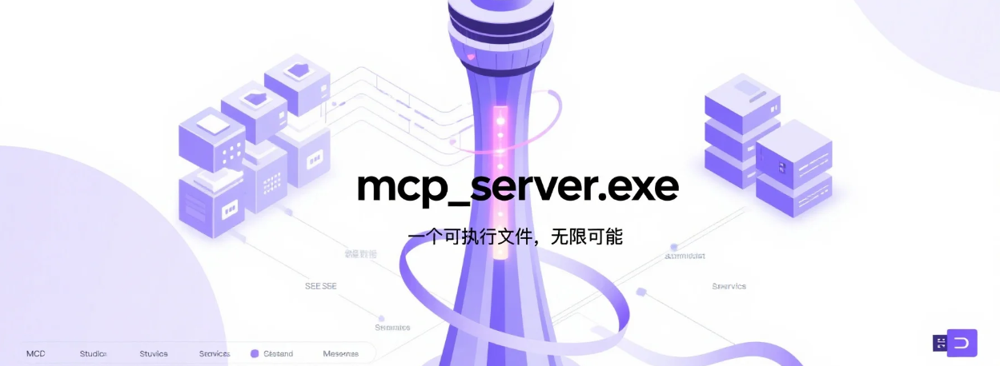
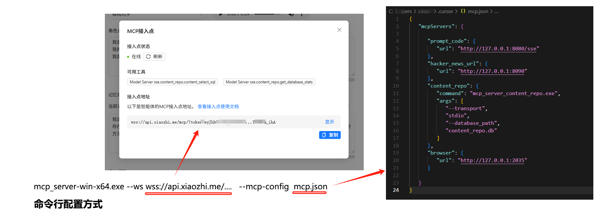

# MCP Server.exe
> 小智 & Cursor 的 MCP 启动器 - MCP For Cursor&xiaozhi

MCP Server.exe 是一个强大的可执行服务器，它不仅能够运行标准的 MCP (Model Context Protocol) 服务，更提供了丰富的高级功能：

- 工具链式调用：支持将多个工具按序组合，实现复杂的自动化流程
- 多 MCP 服务组合：可同时运行和管理多个 MCP 服务，支持 SSE 和 stdio 双模式
- 插件化工具系统：支持自定义工具的动态加载和配置
- 灵活的部署选项：从单机运行到分布式部署，满足各类集成场景

MCP Server.exe is a powerful executable server that not only runs standard MCP (Model Context Protocol) services, but also provides rich advanced features:

- Tool Chain Execution: Support sequential combination of multiple tools for complex automation
- Multiple MCP Services: Can run and manage multiple MCP services simultaneously, supporting both SSE and stdio modes
- Pluggable Tool System: Support dynamic loading and configuration of custom tools
- Flexible Deployment: From standalone operation to distributed deployment, meeting various integration scenarios

### Usage
```bash
npx mcp_exe --mcp-config xxx
```

## 🎯 主要使用场景 | Main Usage Scenarios

### 1. WebSocket 连接模式 | WebSocket Connection Mode

支持通过 WebSocket 连接到其他 MCP 服务，特别适合连接到 xiaozhi.me 等的接入。通过配置文件，可以轻松地将多个 MCP 服务接入到 xiaozhi.me。

Support connecting to other MCP services via WebSocket, especially suitable for connecting to WebSocket-enabled MCP services like xiaozhi.me. Through configuration files, you can easily integrate multiple MCP services with xiaozhi.me.



```bash
# 使用配置文件连接到 xiaozhi.me
# Start in WebSocket mode
./mcp_server.exe --ws wss://api.xiaozhi.me/mcp/?token=...xxx --mcp-config ./examples/mcp-sse.json

```

配置示例 | Configuration Example (mcp-sse.json):
```json
{
    "mcpServers": {
        "Model Server sse": {
            "url": "http://127.0.0.1:3000"
        },
        "Model Server - stdio": {
            "command": "xxxxx",
            "args": [
                "--transport",
                "stdio"
            ]
        }
    },
    "serverInfo": {
        "serverName": "ws-client-mcp-server", 
        "version": "1.0.0",
        "description": "WebSocket 客户端的 MCP 服务器实例",
        "author": "shadow"
    }
}
```

WebSocket 模式特性 | WebSocket Mode Features:
- 支持实时双向通信 | Support real-time bidirectional communication
- 自动重连机制 | Automatic reconnection mechanism
- 多服务统一管理 | Unified management of multiple services
- 兼容标准 MCP 协议 | Compatible with standard MCP protocol

相关项目[可视化xiaozhi-mcp启动器](https://github.com/shadowcz007/xiaozhi-mcp-client)

### 2. 快速启动独立服务 | Quick Start Standalone Service

最简单的使用方式 - 双击运行，即可启动一个标准的 MCP 服务。

The simplest way - double-click to run, and start a standard MCP service.

```bash
# 双击运行 mcp_server.exe，或通过命令行启动
# Double-click mcp_server.exe, or start via command line:
./mcp_server.exe
```

默认配置 | Default Configuration:
- 监听端口 | Listen Port: 3000
- 支持标准端点 | Standard Endpoints: /mcp, /sse, /messages
- 内置基础工具集 | Built-in Basic Tools

### 3. 组合多个 MCP 服务 | Combine Multiple MCP Services

使用和 **Cursor** 一致的 **mcp.json** 配置文件，通过配置文件组合多个 MCP 服务，支持同时使用 SSE 和 stdio 两种传输模式。这样可以根据不同的应用场景选择合适的传输方式，提高系统的灵活性和可扩展性。

Use the same **mcp.json** configuration file as **Cursor** to combine multiple MCP services, supporting both SSE and stdio transport modes simultaneously. This allows you to choose the appropriate transport method for different application scenarios, improving system flexibility and scalability.

```bash
./mcp_server.exe --mcp-config ./examples/mcp.json
```

配置示例 | Configuration Example (mcp.json):
```json
{
    "mcpServers": {
      "Model Server - sse": {
        "url": "http://127.0.0.1:9090"
      },
      "Model Server - stdio": {
        "command":
          "xxx",
        "args": ["--transport", "stdio"]
      }
    }
}
```

### 4. 工具链式调用 | Tool Chain Execution

支持将多个工具组合成工具链，实现复杂的自动化流程。工具链可以灵活配置数据流转和结果输出。

Support combining multiple tools into a tool chain to implement complex automation processes. Tool chains can flexibly configure data flow and result output.

```bash
./mcp_server.exe --mcp-config ./examples/product-hunt/mcp-tool.json
```

配置示例 | Configuration Example (tool-chain.json):
```json
{
    "toolChains": {
        "browser_automation": {
            "name": "browser_automation",
            "description": "自动化浏览器操作流程 | Automated browser operation process",
            "steps": [
                {
                    "toolName": "browser_navigate",
                    "args": {
                        "url": "https://example.com"
                    }
                },
                {
                    "toolName": "browser_execute_javascript",
                    "args": {
                        "code": "document.title"
                    },
                    "outputMapping": {
                        "selector": "content.0.text"
                    }
                },
                {
                    "toolName": "browser_close",
                    "args": {},
                    "fromStep": 0
                }
            ],
            "output": {
                "steps": [1]  // 只输出第二步的结果
            }
        }
    }
}
```

工具链特性 | Tool Chain Features:
- 支持多步骤顺序执行 | Support multi-step sequential execution
- 灵活的数据流转映射 | Flexible data flow mapping
- 可从任意步骤获取结果 | Can get results from any step
- 自定义输出步骤结果 | Customize output step results

### 5. 自定义工具的插件机制 | Custom Tools Plugin Mechanism

通过 JavaScript 配置文件，灵活定义工具、资源和提示。

Flexibly define tools, resources, and prompts through JavaScript configuration files.

```bash
./mcp_server.exe --mcp-js ./my-custom-tools.js
```

配置示例 | Configuration Example (my-custom-tools.js):
```javascript
module.exports = {
  configureMcp: function(server, ResourceTemplate, z) {
    // 添加自定义工具 | Add custom tool
    server.tool({
      name: "myTool",
      description: "自定义工具示例 | Custom tool example",
      parameters: {
        // ... 参数定义 | Parameter definitions
      }
    });
    
    // 添加自定义资源 | Add custom resource
    server.resource(/* ... */);
  }
}
```

### 6. 定时任务模式 (文档待补充)
--cronjob 定时执行tool


### 7. 嵌入式集成 | Embedded Integration

作为独立进程集成到任何应用程序中。

Integrate as a standalone process into any application.

```javascript
// Node.js 示例 | Node.js Example
const { spawn } = require('child_process');

const mcpServer = spawn('./mcp_server.exe', [
  '--port', '3000',
  '--transport', 'stdio'  // 使用 stdio 模式进行进程间通信 | Use stdio mode for IPC
]);

// 处理输入输出 | Handle I/O
mcpServer.stdout.on('data', (data) => {
  // 处理 MCP 服务器的输出 | Handle MCP server output
});

mcpServer.stdin.write(JSON.stringify({
  // 发送请求到 MCP 服务器 | Send request to MCP server
}));
```


## 📚 详细文档 | Detailed Documentation

### 命令行参数 | Command Line Arguments

服务器支持以下命令行参数来自定义其行为：

The server supports the following command line arguments to customize its behavior:

| 参数 | 说明 | 默认值 |
|------|------|--------|
| `--ws <url>` | WebSocket 服务器地址，启用 WebSocket 连接模式 | 无 |
| `--mcp-js <路径>` | 配置文件路径（包含服务器配置和 MCP 配置） | 内置配置 |
| `--port <端口>` | 服务器监听端口 | 3000 |
| `--mcp-config <路径/json字符串>` | MCP 配置文件路径/json字符串，用于组合多个 MCP 服务 | 无 |
| `--transport <模式>` | 传输模式，支持 'sse' 或 'stdio' | sse |

### 配置文件格式 | Configuration File Format

服务器支持使用配置文件同时配置服务器参数和 MCP 功能：

The server supports using a configuration file to configure both server parameters and MCP functionality:

```javascript
module.exports = {
  
  // MCP 配置函数 | MCP configuration function
  configureMcp: function(server, ResourceTemplate, z) {
    // 配置资源和工具 | Configure resources and tools
  }
};
```

### 开发指南 | Development Guide

#### 安装 | Installation
```bash
npm install
```

#### 构建 | Build
```bash
npm run build
```

#### 运行 | Run
```bash
npm start
# 或开发模式 | Or development mode
npm run dev
```

#### 打包 | Packaging
```bash
# 为 Windows 打包 | Package for Windows
npm run package-win

# 为 macOS 打包 | Package for macOS
npm run package-mac
```

打包后的可执行文件将生成在 `executables` 目录中。

The packaged executable files will be generated in the `executables` directory.

### 环境变量 | Environment Variables

- `PORT` - 服务器端口号（默认：3000）| Server port (default: 3000)

## 📝 许可证 | License

MIT
